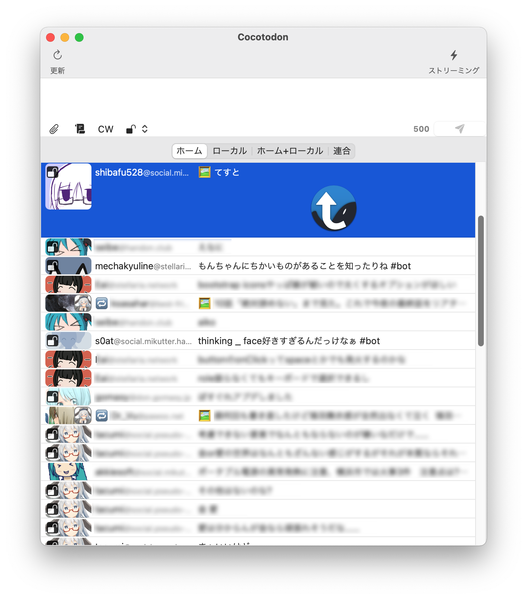

Cocotodon
===

どこか懐かしい感じのMastodonクライアント

<div align="center">

</div>

## Features

* P3:PeraPeraPrvやYoruFukurouのような1行表示
* 投稿ができる
* 画像投稿ができる
* ふぁぼとブーストができる
* ストリーミング受信ができる
* トゥートに添付されている画像はアプリ内でプレビュー可能
* mikutterプラグインとの部分的な互換性

## Requirements

* macOS 11.1 以降のオペレーティングシステム
* Intel Mac と Apple Silicon Mac の両方でネイティブ動作確認済

## License
```
Copyright 2020-2021 shibafu

Licensed under the Apache License, Version 2.0 (the "License");
you may not use this file except in compliance with the License.
You may obtain a copy of the License at

    http://www.apache.org/licenses/LICENSE-2.0

Unless required by applicable law or agreed to in writing, software
distributed under the License is distributed on an "AS IS" BASIS,
WITHOUT WARRANTIES OR CONDITIONS OF ANY KIND, either express or implied.
See the License for the specific language governing permissions and
limitations under the License.
```

## Why Objective-C?

Short answer: お遊びでやっているから。

Long answer: Swiftで書くのが妥当だとは勿論思っているし、仕事なら新規開発でこの選択をすることは絶対にありません。ですが、Objective-Cは今でも一風変わった書き味の言語でありながらも実用可能な、面白い言語だと感じています。もっとも、既視感の薄い言語が触ってみたかっただけかもしれません。Swiftは過去の資産やプラットフォームの事を踏まえた設計ではありますが、言語そのものとしてはここ10年で産まれたものからそんなに外れていない印象があり、どうしても構文や機能に既視感が強いのです。ただ、これは良いことです。求められている安全性や生産性が備わっています。ですから、全く否定する要素はありません。それでも、余暇で遊ぼうと思った時に、ふと後ろに佇んでいるObjective-Cと見比べると遊びが足りないなと思ってしまいました。まぁ、これは言い訳の1つで、もう1つくらいは理由があります。Cocotodonはmrubyの実験用サンドボックスとして書き始めました。mrubyのAPIはC言語です。C言語との相互運用の記述の容易性は、C言語そのものであるObjective-Cが勝ることでしょう。安全性の観点では、Swiftで相互運用のための型を経由して呼び出しをするべきでしょうが、すぐ試して終わりくらいで考えていたので、そんな事はどうでも良かったのです。何も思考を阻害することなく、ストレートにmrubyのAPIを呼べることが楽だと考えたのです。ということで、このアプリはObjective-Cで書かれています。少しでもまともに作るならSwiftでやれば良かったのにね。
